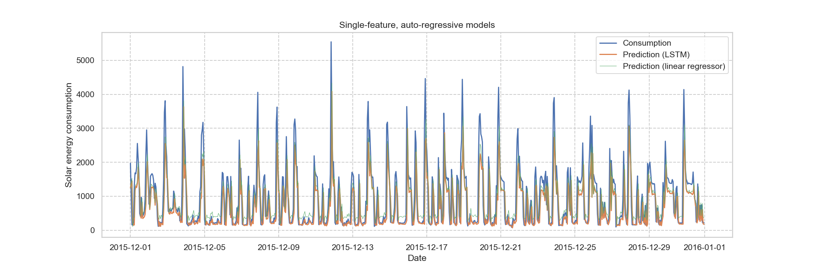
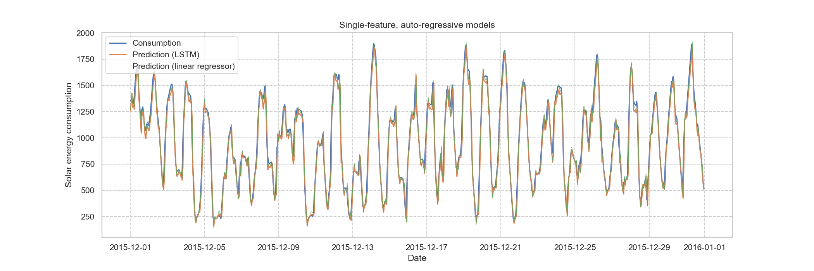
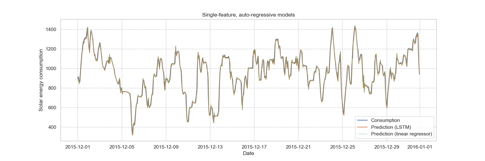

# Predicting solar energy consumption

__Single-feature and multi-feature, auto-regressive LSTM RNN vs linear regression for higly-volatile time series.__  

Project given for the first HackDay at [IFIC](http://webific.ific.uv.es/web/) (University of Valencia/CSIC), research institute where I completed my PhD in Physics.

* Hourly:

* 12-hour basis:

* 24-hour basis:

## Consumption_energy.ipynb

A small town in Spain is sourced by solar energy thanks to a solar plant. Over a year (2015), the plant's energy output and the town's energy consumption data were gathered; and along with it, data from a nearby meteorological station. 

We then come with several models that predict the amount of energy output/consumption given a set of weather conditions. In the notebook, we employ several machine learning techniques to tackle these tasks, among which we construct [Long Short-Term Memory Recurrent Neural Networks](https://en.wikipedia.org/wiki/Long_short-term_memory).

We try and predict with an hourly basis, then a 12-hour basis and finally with a 24-hour basis, and compare. Analizing the differences has important consequences because a model will be more or less accurate depending on the time window to predict.

### Contents

1. Data Preparation
    1. Data cleaning
    2. Data merging
 

2. Predicting energy consumption
    1. Data preparation
    2. Multi-feature linear regression
    3. Single-feature, auto-regressive linear regression
    4. Single-feature, auto-regressive long short-term memory (LSTM) recurrent neural network (RNN)
    5. Multi-feature, auto-regressive LSTM RNN.

3. Summary

4. References
